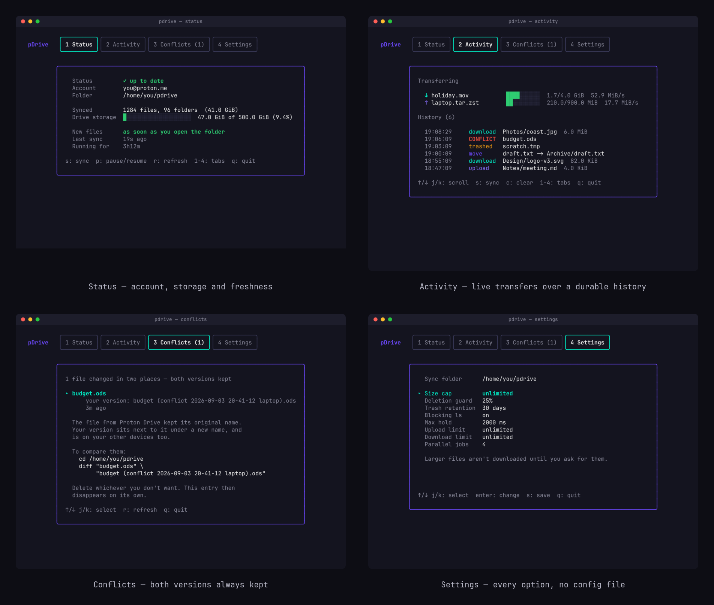
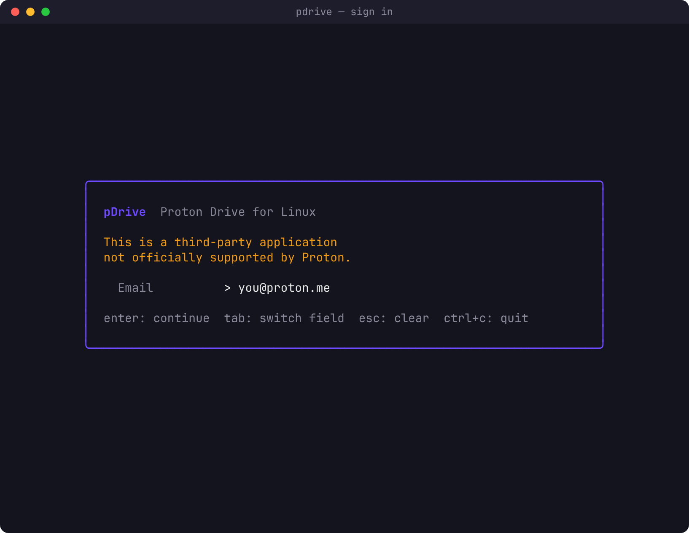

# pDrive

A **Proton Drive sync client for Linux** with a terminal UI. Written in Go.

Daemon-based architecture — syncing continues when you close the TUI. One
folder, `~/pdrive`, kept in both directions: put a file in it and it is in the
cloud, change one elsewhere and it is here.

Unlike the official Proton Drive CLI, pDrive:
- **Actually syncs** — the official CLI has no sync engine by design, only
  upload and download commands
- **Can upload at all** — Proton's per-block verification has been missing
  from every Go client, rclone included, since September 2025
- **Shows a folder that is already current** — an optional root helper holds
  `opendir(2)` for a moment so a listing is not stale
- **Runs as a lightweight daemon** — no Electron, no Python, just Go binaries

> **This is a third-party application not officially supported by Proton.**
> pDrive is not affiliated with or endorsed by Proton AG.

## Screenshots

<p align="center">
  
</p>

Everything the TUI does is also scriptable via `pdrivectl` — useful for
waybar, tmux status bars, cron jobs, or just CI smoke tests:

```console
$ pdrivectl status
State        idle
Account      you@proton.me
Folder       /home/you/pdrive
Synced       1284 files, 96 folders (41.0 GiB on disk)
Drive        47.0 GiB of 500.0 GiB used (9.4%)
New files    as soon as you open the folder
Last sync    18s ago
Uptime       3h12m

$ pdrivectl status --short
pDrive ✓ 1284 files 47.0 GiB

$ pdrivectl watch
watching /home/you/pdrive (daemon idle) — ctrl+c to stop

18:12:32  download     Photos/coast.jpg  6.0 MiB
18:12:34  upload       Notes/meeting.md  4.0 KiB
```

## Features

- Daemon + client architecture (syncing persists when the TUI closes)
- Bidirectional sync with conflict copies — both versions are always kept
- Move and rename detection (a renamed 4 GB file is moved, not re-uploaded)
- Blocking directory listings via `fanotify`, so `ls` is never stale
- Live transfer progress, and an activity log that survives restarts
- Size cap with visible placeholders, fetched on demand
- Modification times preserved in both directions
- Deletions recoverable on both sides — Proton trash and a local trash
- Verified offline backup with a `sha1sum(1)`-compatible manifest
- Encrypted session, SRP login with TOTP and two-password accounts
- Rate-limit aware: a Proton 429 parks *all* traffic rather than sustaining itself

## Requirements

**Required:**

- Linux (any distribution) with `inotify` — used for local change detection
- `systemd` (for the bundled user unit)
- `x86_64` or `aarch64` for prebuilt binaries; other architectures can
  [build from source](#build-from-source)
- A Proton account with Drive

**Required only for specific features:**

- Linux kernel 5.1+ and `CAP_SYS_ADMIN` — only for `pdrive-gate`, the
  optional helper that makes directory listings wait until they are current.
  Everything else runs entirely as your own user.

**NOT required** (unlike Proton's official Drive clients):

- **root** — `pdrived`, `pdrive` and `pdrivectl` run as you, install into
  `~/.local/bin`, and talk over a socket in your own `$XDG_RUNTIME_DIR`.
  `pdrive-gate` is the single privileged component, and it is optional.
- **Python, Electron, or any GUI stack** — pure Go binaries.
- **FUSE, or a kernel module** — pDrive syncs real files into a real
  directory. Nothing is mounted, so your files survive the daemon dying.
- **rclone or the official `proton-drive` CLI** — pDrive talks to the Drive
  API directly, including the per-block verification uploads need.

## Install

### One-liner (any Linux distro)

```bash
curl -fsSL https://raw.githubusercontent.com/YourDoritos/pDrive/main/install.sh | bash
```

This fetches the latest prebuilt binaries from the GitHub release, verifies
checksums, installs them to `~/.local/bin`, and installs the `pdrived` user
unit. **No `sudo`** — the daemon runs as you.

Pin a specific version:

```bash
PDRIVE_VERSION=v0.1.0 curl -fsSL https://raw.githubusercontent.com/YourDoritos/pDrive/main/install.sh | bash
```

Then, in that order — the daemon exits with `not logged in` if you start it
before the first login, so it is not enabled for you:

```bash
pdrive                                  # log in
systemctl --user enable --now pdrived
loginctl enable-linger "$USER"          # keep syncing when logged out
```

> [!NOTE]
> `~/.local/bin` has to be on your `PATH`. The installer says so if it is
> not; most distributions put it there already.

### AUR (Arch Linux)

```bash
yay -S pdrive
```

Installs the binaries to `/usr/bin`, the `pdrived` user unit, and the
optional `pdrive-gate` system unit. Neither unit is enabled for you —
`pdrived` exits with `not logged in` if it starts before your first login,
so log in first:

```bash
pdrive                                  # log in
systemctl --user enable --now pdrived
loginctl enable-linger "$USER"          # keep syncing when logged out
```

The `PKGBUILD` in `dist/` is the same one the AUR package is built from, if
you would rather build it yourself:

```bash
cd dist && makepkg -si
```

### Build from source

Requires Go 1.26+ (see `go.mod`).

```bash
git clone https://github.com/YourDoritos/pDrive.git
cd pDrive
./install.sh --from-source
# equivalently: make install
```

### The listing gate (optional, needs root)

Without it, pDrive checks for changes on a timer. With it, opening a folder
waits until that folder is current.

```bash
# alongside either install method above
curl -fsSL https://raw.githubusercontent.com/YourDoritos/pDrive/main/install.sh | bash -s -- --with-gate

# from a clone
./install.sh --from-source --with-gate

# or, from an installed package
sudo systemctl enable --now pdrive-gate
```

`pdrive-gate` never denies access to a file — it only ever delays a listing,
and it fails open on every error path. Stopping it is always safe.

### Uninstall

```bash
# One-liner (keeps settings and sync state; add --purge to wipe them)
curl -fsSL https://raw.githubusercontent.com/YourDoritos/pDrive/main/uninstall.sh | bash

# AUR
sudo pacman -Rns pdrive

# From a clone
./uninstall.sh
```

Your synced files in `~/pdrive` are never removed, not even by `--purge`, and
your Proton Drive account is untouched.

## Build

```bash
make build          # all four binaries into ./bin
make test
make fmtcheck
make lint           # needs golangci-lint
make screenshots    # regenerate the README images
```

## Usage

```bash
# Start the daemon (if not using systemd)
pdrived -f

# Open the TUI
pdrive

# Scriptable
pdrivectl status --short      # one line, for a status bar
pdrivectl sync                # run a pass now and wait for it
pdrivectl watch               # follow activity as it happens
pdrivectl pause / resume
pdrivectl conflicts           # list preserved local copies
pdrivectl get <path>          # download a file left as a placeholder
pdrive backup                 # separate verified archive of the account
```

On first launch the TUI shows a login screen — SRP, with TOTP and
two-password accounts supported. After that the session is saved and `pdrive`
opens straight on Status.

<p align="center">
  
</p>

### Keybindings

| Key | Action |
|---|---|
| `1` – `4` | Switch tab (Status, Activity, Conflicts, Settings) |
| `←` `→` | Cycle tabs |
| `esc` | Back to Status |
| `s` | Sync now — or **save** on Settings, **start the daemon** when it is down |
| `e` | Start the daemon and enable it at login (Status, when down) |
| `p` | Pause / resume syncing |
| `r` | Refresh |
| `↑` `↓` `j` `k` | Move within a list |
| `enter` | Change the selected setting |
| `c` | Clear the activity log |
| `q`, `ctrl+c` | Quit |

### Settings

Everything is editable in the Settings tab — the daemon picks changes up
without a restart.

| Setting | What it does |
|---|---|
| Sync folder | Where your files live. Changing it **moves** them, it does not download them again |
| Size cap | Larger files are not downloaded until you ask for them |
| Deletion guard | Stops a sync that would delete more of your files than this |
| Trash retention | How long deleted files stay recoverable on this computer |
| Blocking `ls` | Wait for new files to arrive before listing a folder |
| Max hold | How long a listing may wait |
| Upload / download limit | Bandwidth caps |
| Parallel jobs | How many files transfer at once |

## Safety

A sync client's real job is not moving files, it is not losing them.

- **Nothing is ever permanently deleted remotely.** Local deletions become
  Proton trash entries.
- **Nothing is ever unlinked locally.** Remote deletions move the file to
  `~/.local/share/pdrive/trash/`.
- **A conflict never discards either version.** The remote version keeps the
  original name, yours is preserved beside it, and both are uploaded.
- **A pass that would delete a large share of your files is refused.**
- **An empty sync folder with a populated database stops the sync** — that is
  far more often an unmounted disk than an intentional wipe.
- **Symlinks are not followed.** A link to `~/.ssh/id_rsa` cannot pull it into
  your account.
- **Names from the server are validated, never trusted.** A file called
  `../../.bashrc` cannot escape the sync folder.

`pdrive backup` makes a separate verified copy with a manifest that standard
tools can check, without trusting pDrive:

```bash
pdrive backup && cd ~/pdrive-backup-* && sha1sum -c MANIFEST.sha1
```

## How it works

`pdrived` runs as a **user** systemd service and owns the sync loop (the
state database, the Proton session, transfers, conflict handling). `pdrive`
(TUI) and `pdrivectl` (CLI) are clients that talk to it over a Unix socket at
`$XDG_RUNTIME_DIR/pdrive.sock`. Nothing in that path needs privilege.

1. Authenticates via Proton's SRP protocol, with TOTP and two-password support
2. Derives the PGP key passphrase and unlocks the Drive key hierarchy
3. Mirrors the account into the sync folder, recording a baseline in SQLite
4. Follows Proton's volume event cursor for remote changes, and `inotify` for
   local ones
5. Reconciles three ways — local, remote, and the last state both agreed on
6. Uploads in 4 MiB blocks, each carrying a per-block verification token

`pdrive-gate` is separate and optional. It runs as root because `fanotify`
permission events require `CAP_SYS_ADMIN`, holds `opendir(2)` on the sync
folder for up to `max_block_ms`, and asks the daemon to bring that one
directory up to date before releasing it. It performs no network I/O, holds
no credentials, and authorises callers by peer credentials — the folder it is
asked to watch must be owned by the uid that asked.

## Config

Stored in `~/.config/pdrive/config.toml`. Session data in
`~/.local/state/pdrive/session.enc`, encrypted with a machine-id derived key.
Sync state in `~/.local/state/pdrive/state.db`.

See [SECURITY.md](SECURITY.md) for the threat model, and
[docs/PROJECT_SPEC.md](docs/PROJECT_SPEC.md) for the design: the freshness
mechanism and its measurements, the reconciler's rules, and the safety guards.

## License

GPL-3.0. See [LICENSE](LICENSE).
